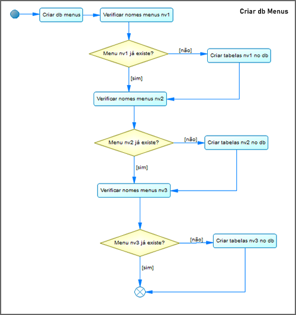
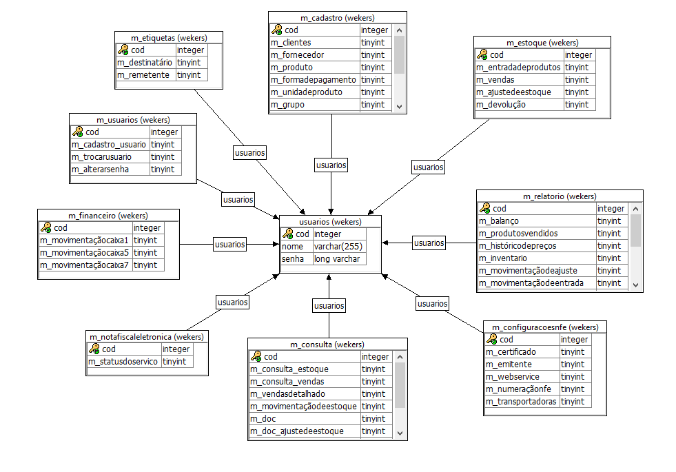

# PowerBuilder: Menu  -> Banco de Dados (Database) e setar Permissões de cada Usuário (User Access Permissions)

## Visão Geral

Criar Tabelas e Colunas no Banco de Dados conforme os menus existentes no software.
Criar e editar as permissões para cada usuário do sistema.
Ao se logar o usuário terá acesso apenas ao que foi permitido a ele.

A imagem abaixo, demonstra o menu atual da aplicação.


Como fica a Tela -> Setar as Permissões de Menus por Usuário(a).


***
#### Cenário:

***
## 1. Gerar as tabelas e colunas no banco de dados, conforme os menus atuais do sistema.

**1.1. Requisito: Ter a tabela "usuarios" no db**


**1.2. Deve-se criar uma nova **`Window`** ou um **`button`,** após adicionar e executar o script: CRIAR DB NOMES MENUS**

Diagrama de Atividade:



(ao executá-lo, vai gerar/criar as tabelas e as colunas no db automáticamente, conforme o nome dos menus)

*Este Script se deve executar apenas uma vez.*

```cpp
// **** CRIAR DB NOMES MENUS ****

// variaveis
long li_totalitem[],li_a,li_b,li_c;
string ls_name, ls_name_niv2, ls_name_niv3, ls_name_text;


messagebox("Menus","Criando banco de dados de menus")

//dimensao de item em nivel 1
li_totalitem[1] = upperbound (w_index.menuid.item);
	for li_a = 1 to li_totalitem[1]
		ls_name = w_index.menuid.item[li_a].classname() ;
			
		integer resultado

		SELECT count() 
		Into :resultado
		FROM sysobjects 
		Where name = :ls_name;

		//ignora o menu "Editar" e "Sistema"
		If (resultado > 0 or ls_name = "m_editar" or ls_name = "m_sistema") Then
			//messagebox("O menu: ",ls_name +" já está no bd")
		else
			messagebox("O menu: ",ls_name +" vai ser adicionado ao bd")

			string      SQL
 			SQL = "CREATE TABLE "+ls_name &
   				    + "(cod integer not null, " &
					+ "PRIMARY KEY( cod ),"	&
					+ "FOREIGN KEY REFERENCES usuarios)"
	 		EXECUTE IMMEDIATE :SQL ;	
	 
		End If
	
		//obtemos a dimensao de item em nivel 2
		li_totalitem[2] = upperbound (w_index.menuid.item[li_a].item);
	

			For 	li_b = 1 to li_totalitem[2]
				ls_name_niv2 = w_index.menuid.item[li_a].item[li_b].classname();

				
				integer resultado_niv2	
				select count()
				Into :resultado_niv2
				from syscolumn join systable on systable.table_id = syscolumn.table_id where table_name = :ls_name and column_name = :ls_name_niv2;
			
				//ignora o menu "Editar" e "Sistema"
				If (resultado_niv2 > 0 or ls_name = "m_editar" or ls_name = "m_sistema") Then
					//messagebox("O menu: ",ls_name_niv2 +" já está no bd")
				else
					messagebox("O menu: ",ls_name +"-> "+ ls_name_niv2 +" vai se adicionado ao bd")
					string      SQL2
					
					
					//Esses menus vão ser default, sempre setado em valor "1", 
                    //pois todos usuários devem ter acesso
					if (ls_name_niv2 = "m_trocarusuario" or ls_name_niv2 = "m_alterarsenha" or ls_name_niv2 = "m_sair" or ls_name_niv2 = "m_sobre") then
							SQL2 = "ALTER TABLE "+ls_name &
							+ " ADD "+ls_name_niv2 +" tinyint default 1 not null"
						 	EXECUTE IMMEDIATE :SQL2  USING SQLCA ;	
					
					// não adiciona separador de menu -----
					elseif  not (ls_name_niv2 = "m_0" or ls_name_niv2 =  "m_1") then
							SQL2 = "ALTER TABLE "+ls_name &
							+ " ADD "+ls_name_niv2 +" tinyint default 0 not null"
			 				EXECUTE IMMEDIATE :SQL2  USING SQLCA ;					 		
					end if
					
				End If


	    //obtemos a dimensao de item em nivel 3
		li_totalitem[3] = upperbound (w_index.menuid.item[li_a].item[li_b].item);


			For 	li_c = 1 to li_totalitem[3]
				ls_name_niv3 = w_index.menuid.item[li_a].item[li_b].item[li_c].classname() ;


				integer resultado_niv3	
				select count()
				Into :resultado_niv3
				from syscolumn join systable on systable.table_id = syscolumn.table_id where table_name = :ls_name and column_name = :ls_name_niv3;

			
				If (resultado_niv3 > 0) Then
					//messagebox("O menu: ",ls_name_niv3 +" já está no bd")
				else
					messagebox("O menu: ",ls_name +"-> "+ ls_name_niv2 +  ls_name_niv3 +" vai ser adicionado ao bd")
					string      SQL3
					SQL3 = "ALTER TABLE "+ls_name &
						+ " ADD "+ls_name_niv3 +" tinyint default 0 not null"
					 	EXECUTE IMMEDIATE :SQL3  USING SQLCA ;	
				end if					
			
			

			//vai agregando o nivel dos submenu
			next; //for li_c


		//vai agregando o nivel dos submenu
		next; //for li_b


	next; //for li_a

close(this)

```

* * *

>##### **Diagrama do Banco de Dados:**


* * *
## 2. Criar a Datawindow, conforme syntax sql
*Este é um exemplo de <ins>nomes de MENU</ins> que foi gerado anteriormente.*

```sql
  SELECT "m_usuarios"."m_cadastro_usuario",   
         "m_usuarios"."m_trocarusuario",   
         "m_usuarios"."m_alterarsenha",   
         "m_cadastro"."m_clientes",   
         "m_cadastro"."m_fornecedor",   
         "m_cadastro"."m_produto",   
         "m_cadastro"."m_formadepagamento",   
         "m_cadastro"."m_unidadeproduto",   
         "m_cadastro"."m_grupo",   
         "m_cadastro"."m_tipodeitem",   
         "m_cadastro"."m_localdoproduto",   
         "m_cadastro"."m_alterar",   
         "m_cadastro"."m_alterar_fornecedor",   
         "m_cadastro"."m_alterar_produto",   
         "m_consulta"."m_consulta_estoque",   
         "m_consulta"."m_consulta_vendas",   
         "m_consulta"."m_vendasdetalhado",   
         "m_consulta"."m_movimentaçãodeestoque",   
         "m_consulta"."m_doc",   
         "m_consulta"."m_doc_ajustedeestoque",   
         "m_consulta"."m_doc_entrada",   
         "m_consulta"."m_doc_venda",   
         "m_consulta"."m_doc_devolução",   
         "m_configuracoesnfe"."m_certificado",   
         "m_configuracoesnfe"."m_emitente",   
         "m_configuracoesnfe"."m_webservice",   
         "m_configuracoesnfe"."m_numeraçãonfe",   
         "m_configuracoesnfe"."m_transportadoras",   
         "m_estoque"."m_entradadeprodutos",   
         "m_estoque"."m_vendas",   
         "m_estoque"."m_ajustedeestoque",   
         "m_estoque"."m_devolução",   
         "m_etiquetas"."m_destinatário",   
         "m_etiquetas"."m_remetente",   
         "m_financeiro"."m_movimentaçãocaixa1",   
         "m_financeiro"."m_movimentaçãocaixa5",   
         "m_financeiro"."m_movimentaçãocaixa7",   
         "m_notafiscaleletronica"."m_statusdoservico",   
         "m_relatorio"."m_balanço",   
         "m_relatorio"."m_produtosvendidos",   
         "m_relatorio"."m_históricodepreços",   
         "m_relatorio"."m_inventario",   
         "m_relatorio"."m_movimentaçãodeajuste",   
         "m_relatorio"."m_movimentaçãodeentrada",   
         "m_relatorio"."m_movimentaçãodevenda",   
         "m_relatorio"."m_movimentaçãodedevolução",   
         "m_relatorio"."m_orçamento",   
         "m_relatorio"."m_produtossaldonegativo",   
         "m_relatorio"."m_preçosemarkup",   
         "m_relatorio"."m_gráficodesempenhodiario",   
         "m_relatorio"."m_gráficodesempenhomensal"  
    FROM "m_usuarios",   
         "m_cadastro",   
         "m_configuracoesnfe",   
         "m_consulta",   
         "m_estoque",   
         "m_etiquetas",   
         "m_financeiro",   
         "m_notafiscaleletronica",   
         "m_relatorio"  
   WHERE ( "m_usuarios"."cod" = "m_cadastro"."cod" ) and  
         ( "m_usuarios"."cod" = "m_configuracoesnfe"."cod" ) and  
         ( "m_usuarios"."cod" = "m_consulta"."cod" ) and  
         ( "m_usuarios"."cod" = "m_estoque"."cod" ) and  
         ( "m_usuarios"."cod" = "m_etiquetas"."cod" ) and  
         ( "m_usuarios"."cod" = "m_financeiro"."cod" ) and  
         ( "m_usuarios"."cod" = "m_notafiscaleletronica"."cod" ) and  
         ( "m_usuarios"."cod" = "m_relatorio"."cod" ) and  
         ( ( "m_usuarios"."cod" = :cod ) )    

```
***
> **- Propriedades da Datawindow: (Obs. sem Text no menu <ins>Edit</ins> das colunas!)**


> **- Pois o mesmo vai puxar pelo nome da <ins>Text</ins> do próprio menu, no código a seguir: RECUPERAR DADOS**


> **- Na Window, adiciona a `datawindow`, um `button` de título <ins>Salvar Permissões</ins> e um `checkbox` de título <ins>Selecionar Todos</ins>:**


***
## 3. Recuperar os dados das colunas que estão no banco de dados na `window`-> `tab_1` <ins>*evento*</ins>: `selectionchanging`


> **Conforme código abaixo:**

```cpp
// **** RECUPERAR DADOS - (tab_1 -> eveto: selectionchanging) ****

Integer ll, ll_n
ll = this.tabpage_1.dw_1.getrow()

if(recuperar > 0) then

	Integer codigo
	codigo = this.tabpage_1.dw_1.GetItemNumber(ll,"cod")
	String nome 
	nome = this.tabpage_1.dw_1.GetItemString(ll,"nome")


	If (This.Control[newindex].Text = "Permissões") then

		m_menu.m_editar.m_fechar.enabled = true
		m_menu.m_editar.m_incluir.enabled = false
		m_menu.m_editar.m_gerar.enabled = false
		m_menu.m_editar.m_confirmar.enabled = false
		m_menu.m_editar.m_excluir.enabled = false
		this.tabpage_2.st_nome.text = "[ "+ string(codigo)+" "+nome+" ]"
		this.tabpage_2.dw_2.settransobject(SQLCA)
		integer retrieve_tab_permissoes
		retrieve_tab_permissoes = this.tabpage_2.dw_2.retrieve(codigo)
		
		
	else
		w_cad_usuarios.TriggerEvent("activate")
	end if


	this.tabpage_2.st_nome.text = "[ "+ string(codigo)+" ] "+nome
	

End if

// ********************************************
//Recuperar dados dos menus, conforme está no db
long li_totalitem[],li_a,li_b,li_c;
string ls_name, ls_name_niv2, ls_name_niv3, ls_name_text;

	li_totalitem[1] = upperbound (w_index.menuid.item);
	
	 //obtemos a dimensao de item em nivel 1
	for li_a = 1 to li_totalitem[1]
		ls_name = w_index.menuid.item[li_a].classname() ;
		li_totalitem[2] = upperbound (w_index.menuid.item[li_a].item);
	
		 	//obtemos a dimensao de item em nivel 2
			For 	li_b = 1 to li_totalitem[2]
				ls_name_niv2 = w_index.menuid.item[li_a].item[li_b].classname();
                
				//ignora o menu Editar, Sistema e as barras de separação
				If not ( ls_name = "m_editar" or ls_name = "m_sistema" or ls_name_niv2 = "m_0" or ls_name_niv2 =  "m_1") Then

					//Pega o Text do próprio menu e mostra como Text na checkbox na datawindow
					ls_name_text = w_index.menuid.item[li_a].item[li_b].text;
				
					string texto_menu
					texto_menu = 	ls_name+"_"+ls_name_niv2+".CheckBox.text='"+ls_name_text+"'"
	
					//	messagebox("O menu: ",ls_name_niv2+"texto: "+ls_name_text+" modify = "+texto_menu)
	
					this.tabpage_2.dw_2.Modify(texto_menu)
				
				end if
			
			
	   			 //obtemos a dimensao de item em nivel 3
				li_totalitem[3] = upperbound (w_index.menuid.item[li_a].item[li_b].item);


				For 	li_c = 1 to li_totalitem[3]
					ls_name_niv3 = w_index.menuid.item[li_a].item[li_b].item[li_c].classname() ;
					string 				ls_name_text3 
					ls_name_text3 = w_index.menuid.item[li_a].item[li_b].item[li_c].text ;
								
				
					integer resultado_niv3	
					select count()
					Into :resultado_niv3
					from syscolumn join systable on systable.table_id = syscolumn.table_id where table_name = :ls_name and column_name = :ls_name_niv3;

			
					If (resultado_niv3 > 0) Then

						texto_menu = 	ls_name+"_"+ls_name_niv3+".CheckBox.text='"+ls_name_text+"->"+ls_name_text3+"'"
						this.tabpage_2.dw_2.Modify(texto_menu)
	
					end if
					
					
				next //fecha laço for nivel 3
				
				
			next //fecha laço for nivel 2


	next //fecha laço for nivel 1
```
---
**3.1. Gravar, salvar as informações dos checkbox:**
Na `window` no botão <ins>`Salvar Permissões`</ins> de nome `cb_salvar` -> <ins>evento</ins> `clicked`.

```cpp
// **** GRAVAR/SALVAR DATAWINDOW (botão: cb_salvar -> evento: clicked) ****

integer ll, gravar_tab2
ll = tab_1.tabpage_1.dw_1.GetRow()

Integer cod_u
cod_u = tab_1.tabpage_1.dw_1.GetItemNumber(ll,"cod")
String nome 
nome = tab_1.tabpage_1.dw_1.GetItemString(ll,"nome")


//1. Nome das Colunas
Integer li_col_count, i, valor
string ls_columns[], valor_columns[], tabela[]


li_col_count = integer(tab_1.tabpage_2.dw_2.Describe("DataWindow.Column.Count"))

FOR i = 1 TO li_col_count

	ls_columns[i] =tab_1.tabpage_2.dw_2.Describe("#" + String(i) + ".dbName") // db + .tabelas


	//2. Substitui o caractere . por _
	IF POS(ls_columns[i], ".") > 0 THEN
		valor_columns[i] = Replace (ls_columns[i], POS(ls_columns[i], "."), 1, "_")
	END IF

	//3. Valor atual das colunas
	valor 	= tab_1.tabpage_2.dw_2.getitemnumber(1,valor_columns[i])

	//4. substitui todos caracteres a direita de . por ""
	IF POS(ls_columns[i], ".") > 0 THEN
		integer tam
		tam = len(ls_columns[i])
		tabela[i] = Replace (ls_columns[i], POS(ls_columns[i], "."), tam, " ")
	END IF


	// ********************************
	//5. Update db pelos valores atuais
	string sql_syntax
	
		sql_syntax = "UPDATE  "+tabela[i] &
						+ " SET "+ ls_columns[i] + "= "+string(valor) &
						+ " WHERE  cod = " +string(cod_u )
	
	EXECUTE IMMEDIATE :sql_syntax USING SQLCA ;
	// ********************************

		
	If sqlca.sqlcode <> 0 Then
		Messagebox("Error cadatro_usuarios -> permissões",Sqlca.sqlerrtext)
	End If
	
NEXT


this.enabled = false

messagebox("Permissões!","As permissões de [ "+ string(cod_u)+" - "+nome+" ], foram salvas!")
```
---
**3.2. Checkbox, *<ins>Selecionar Todos</ins>* -> exemplo de nome `cbx_sel_todos`:**
-> <ins>evento</ins> `clicked`
```cpp
// **** SELECIONAR TODOS Checkbox (cbx_sel_todos -> evento: clicked) ****

Integer li_col_count, i, valor
string colunas[]


if (this.Checked = true) then
	valor = 1
else
	valor = 0	
end if


li_col_count = integer(tab_1.tabpage_2.dw_2.Describe("DataWindow.Column.Count"))

FOR i = 1 TO li_col_count

	colunas[i] =tab_1.tabpage_2.dw_2.Describe("#" + String(i) + ".Name") // nome da coluna
	tab_1.tabpage_2.dw_2.SetItem ( 1, colunas[i], valor ) // row, coluna, valor a setar 
	tab_1.tabpage_2.dw_2.object.m_usuarios_m_trocarusuario[1] = 1 //sempre 1
	tab_1.tabpage_2.dw_2.object.m_usuarios_m_alterarsenha[1] = 1 //sempre 1

NEXT

tab_1.tabpage_2.cb_salvar.enabled = true

```
---
## 4. Adicionar, Salvar ou Excluir um Novo Usuário:
**4.1. Suponha que você tenha um `botão principal` e um evento global para cada window ex: `ue_inclui`:**


**Código, `ue_incluir`:**

```cpp
// **** INCLUIR USUARIO (evento: ue_incluir) ****

long linha

tab_1.tabpage_1.dw_1.Modify("cod.Protect='1~tIf(IsRowNew(),0,1)'")
tab_1.tabpage_1.dw_1.Modify("nome.Protect='1~tIf(IsRowNew(),0,1)'")
tab_1.tabpage_1.dw_1.SetTabOrder(1, 10)
tab_1.tabpage_1.dw_1.SetTabOrder(2, 20)
linha = tab_1.tabpage_1.dw_1.InsertRow(0)
tab_1.tabpage_1.dw_1.ScrollToRow(linha)
tab_1.tabpage_1.dw_1.SetColumn(1)

m_menu.m_editar.m_excluir.enabled = true
m_excluir = True
m_menu.m_editar.m_confirmar.enabled = false
m_confirmar = false
m_menu.m_editar.m_incluir.enabled = false
m_incluir = false
incluir = true
```
**4.2. Excluir `botão principal` e um evento global da window ex: `ue_excluir`:**

**Código, `ue_excluir`:**

```cpp
// **** EXCLUIR USUARIO (evento: ue_excluir) ****

Integer wk_ret, gravar, ll, existe_venda, cod_user
ll = tab_1.tabpage_1.dw_1.GetRow()
String nome 

nome = tab_1.tabpage_1.dw_1.GetItemString(ll,"nome")

cod_user = tab_1.tabpage_1.dw_1.GetItemNumber(ll,"cod")
Select count()
Into :existe_venda
From movimento_saida
Where cod_vendedor = :cod_user;

If (existe_venda > 0) then
	Messagebox("Atenção", "Não é possível excluir: " + "[ " +String(tab_1.tabpage_1.dw_1.GetItemString(ll,"nome")) +" ]" &
	+" - Existem dados (vendas) vinculados a este Usuário(a)!", StopSign!)
	

else

	dwitemstatus    rowstatus

	IF tab_1.tabpage_1.dw_1.GetRow() > 0 THEN
   		rowstatus = tab_1.tabpage_1.dw_1.GetItemStatus( tab_1.tabpage_1.dw_1.GetRow(), 0, Primary! )
	
   		IF rowstatus = New! OR rowstatus = NewModified! THEN
	
			tab_1.tabpage_1.dw_1.DeleteRow(tab_1.tabpage_1.dw_1.GetRow())
			tab_1.tabpage_1.dw_1.Modify("cod.Protect='0'")
			tab_1.tabpage_1.dw_1.Modify("nome.Protect='0'")
			tab_1.tabpage_1.dw_1.SetTabOrder(1, 0)
			m_menu.m_editar.m_incluir.enabled = true
			m_incluir = true

	
		else


			wk_ret = MessageBox("Atenção", & 
					"Deseja Realmente Excluir o Usuário(a): " + "[" +String(tab_1.tabpage_1.dw_1.GetItemString(ll,"nome")) +"]", &
		    		 Exclamation!,YesNo!,1)


			IF wk_ret = 1 Then
	
				
				// *** Delete db menus primeiro, pois são FOREIGN KEY
				long li_totalitem[],li_a
				string tabela
				li_totalitem[1] = upperbound (w_index.menuid.item);
	
				FOR li_a = 1 to li_totalitem[1]
					
					tabela = w_index.menuid.item[li_a].classname() ;
					If not (tabela = "m_editar" or tabela = "m_sistema") Then

					string      delete_sql
 					delete_sql = "DELETE FROM "+tabela &
									+ " WHERE cod = " +string(cod_user)
		 						EXECUTE IMMEDIATE :delete_sql ;	
	 
					end if
					
				NEXT

				tab_1.tabpage_1.dw_1.DeleteRow(tab_1.tabpage_1.dw_1.GetRow())
				tab_1.tabpage_1.dw_1.settransobject(SQLCA)
	
				gravar = tab_1.tabpage_1.dw_1.Update(True, True)

					If gravar = 1 Then
						Commit;
						messagebox("Cadastro Usuários!","O Usuário(a): " + "[ " +nome +" ] foi excluido!")
					Else
						
						MessageBox("Erro",SQLCA.SQLErrText)
						RollBack;
						
					End If
							
							If tab_1.tabpage_1.dw_1.GetRow() = 0 THEN
				
								m_menu.m_editar.m_excluir.enabled = false
								m_excluir = false
								tab_1.tabpage_2.enabled = false
					
							End If
							
					
			End if //fecha if wk_ret
			
		End if //fecha if rowstatus

	End If //fecha if getrow

End If //fecha if existe venda
```

**4.3. Confirmar/Salvar `botão principal` e um evento global da window ex: `ue_salvar`:**

**Código, `ue_salvar`:**

```cpp
// **** SALVAR USUARIO (evento: ue_salvar) ****

Integer gravar, gravar2, ll, gravar_tabpage_2, cod_u
String nome

if (incluir) then
	ll = tab_1.tabpage_1.dw_1.GetRow()
	tab_1.tabpage_1.dw_1.settransobject(SQLCA)

	gravar = tab_1.tabpage_1.dw_1.Update(True, True)
    cod_u = tab_1.tabpage_1.dw_1.GetItemNumber(ll,"cod")
	nome =	tab_1.tabpage_1.dw_1.GetItemString(ll,"nome")

	if gravar = 1 then
	
		Commit;
	
		m_menu.m_editar.m_confirmar.enabled = false
		m_confirmar = false
		m_menu.m_editar.m_incluir.enabled = true
		m_incluir = true

		tab_1.tabpage_1.dw_1.Modify("cod.Protect='1'")
		tab_1.tabpage_1.dw_1.Modify("nome.Protect='1'")
		tab_1.tabpage_1.dw_1.SetTabOrder(1, 0)
		tab_1.tabpage_1.dw_1.SetTabOrder(2, 0)

		
		tab_1.tabpage_2.enabled = true
		tab_1.tabpage_1.dw_1.Scrolltorow(ll)
		
	
	//*** Insert db menus
	long li_totalitem[],li_a
	string tabela
	li_totalitem[1] = upperbound (w_index.menuid.item);
	
	FOR li_a = 1 to li_totalitem[1]
		tabela = w_index.menuid.item[li_a].classname() ;

		//ignora menu -> Editar e Sistema
		If not (tabela = "m_editar" or tabela = "m_sistema") Then


			string      insert_sql
 			insert_sql = "INSERT INTO "+tabela  + " (cod) " &
							+ "VALUES  ("+ string(cod_u)+")"
		 					EXECUTE IMMEDIATE :insert_sql ;	
	 
		end if
		
	NEXT
	//***		
			
		messagebox("Cadastro Usuários!","O Usuário [ "+ string(cod_u)+" - "+nome+" ] foi adicionado!")

			If sqlca.sqlcode <> 0 Then
				Messagebox("Error on Commit",Sqlca.sqlerrtext)
			End If
			
		incluir = false
			
	else
		
		RollBack;
			
	end if
	
end if

```
## 5. Recuperar as informações na Abertura do Software <ins>*de qual menu*</ins> está liberado para o Usuário, <ins>conforme foi setado?</ins>

**Na window principal a qual foi <ins>inherited</ins>, no evento: <ins>`open`</ins>**

```java
// **** JANELA PRINCIPAL - Tela inicial -> após login ( evento: open) ****

w_index.SetMicroHelp("LOGADO: "+string(codigo_usuario)+" - "+nome_usuario)

//Codigo 99999 = Desenvolvedor
//Menus que somente o desenvolvedor tem acesso
If codigo_usuario <> 99999 then m_menu.m_sistema.m_importforn.visible = false
If codigo_usuario <> 99999 then m_menu.m_sistema.m_import.visible = false
If codigo_usuario <> 99999 then m_menu.m_sistema.m_importtitem.visible = false
If codigo_usuario <> 99999 then m_menu.m_sistema.m_importcategoriagrupo.visible = false
If codigo_usuario <> 99999 then m_menu.m_sistema.m_importgrupo.visible = false
If codigo_usuario <> 99999 then m_menu.m_sistema.m_importupdate.visible = false
If codigo_usuario <> 99999 then m_menu.m_sistema.m_criarmenudb.visible = false

//os demais usúarios executa o script abaixo
if codigo_usuario <> 99999 then
	
// Menu Permissoes - DataStore
datastore lds_menu
lds_menu = create datastore
lds_menu.dataobject = 'd_user_permissoes' //a datawindow

lds_menu.settransobject(sqlca)
lds_menu.retrieve(codigo_usuario)


//Declarações Colunas nomes
Integer li_col_count, i, valor
long li_totalitem[],li_a,li_b,li_c;
string ls_name, ls_name_niv2, ls_name_niv3, ls_name_text;

//1. Dimensao de item em nivel 1
li_totalitem[1] = upperbound (w_index.menuid.item);
	for li_a = 1 to li_totalitem[1]
		ls_name = w_index.menuid.item[li_a].classname() ;
			
		//2. Obtemos a dimensao de item em nivel 2
		li_totalitem[2] = upperbound (w_index.menuid.item[li_a].item);
	
			For 	li_b = 1 to li_totalitem[2]
				ls_name_niv2 = w_index.menuid.item[li_a].item[li_b].classname();
				//ignora menu Editar, Sistema e separadores de menus ----
				If not (ls_name = "m_editar" or ls_name = "m_sistema" or ls_name_niv2 = "m_0" or ls_name_niv2 =  "m_1") Then
					string db_menu_atual 
					db_menu_atual = ls_name+"_"+ls_name_niv2
				
					valor 	= lds_menu.getitemnumber(1,db_menu_atual)
				
                	/* Aqui fica em escolha, disabled ou invisible?
                	 A preferência é invisível, pois o funcionário que não tem permissão,
                	 nem deve saber que existe tal funcionalidade no Sistema*/
					if valor = 1 then
						w_index.menuid.item[li_a].item[li_b].visible = true
						//w_index.menuid.item[li_a].item[li_b].enabled = true
					else
						w_index.menuid.item[li_a].item[li_b].visible = false
						//w_index.menuid.item[li_a].item[li_b].enabled = false
					end if
			
				end if
			
			
			 //3. Obtemos a dimensao de item em nivel 3
			li_totalitem[3] = upperbound (w_index.menuid.item[li_a].item[li_b].item);


				For 	li_c = 1 to li_totalitem[3]
					ls_name_niv3 = w_index.menuid.item[li_a].item[li_b].item[li_c].classname() ;

					integer resultado_niv3	
					select count()
					Into :resultado_niv3
					from syscolumn join systable on systable.table_id = syscolumn.table_id where table_name = :ls_name and column_name = :ls_name_niv3;

			
					If (resultado_niv3 > 0) Then
						db_menu_atual = ls_name+"_"+ls_name_niv3
						valor 	= lds_menu.getitemnumber(1,db_menu_atual)

						if valor = 1 then
							w_index.menuid.item[li_a].item[li_b].item[li_c].visible = true
							//w_index.menuid.item[li_a].item[li_b].item[li_c].enabled = true
						else
							w_index.menuid.item[li_a].item[li_b].item[li_c].visible = false
							//w_index.menuid.item[li_a].item[li_b].item[li_c].enabled = false
						end if

					end if					
					

				next; //for li_c
			
		next//for li_b
	
	next//for li_a

end if

// Verifica se a data da última venda foi maior que a de hoje, neste caso, o relógio do windows está errada.
Integer resultado
Select count()
Into :resultado
From movimento_saida
Where data_saida > today();

If (resultado > 0) then 
	MessageBox("Atenção", "O Sistema 'Retaguarda de Loja' detectou que a Data atual está incorreta. Verifique a Data do Calendário do Windows para executar o Programa novamente.", StopSign!)
	Close(w_index)
End If
```
***EOF***
***
***
***

## Pré-requisitos

Foi testado no PowerBuilder 12.5 (Sybase, SAP), 2017 R2 (Appeon).

Sybase SQL Anywhere 9

OS: Windows 7 e Windows 10 (x86 e x64)
